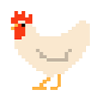
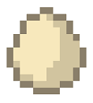
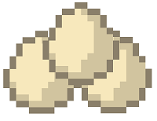
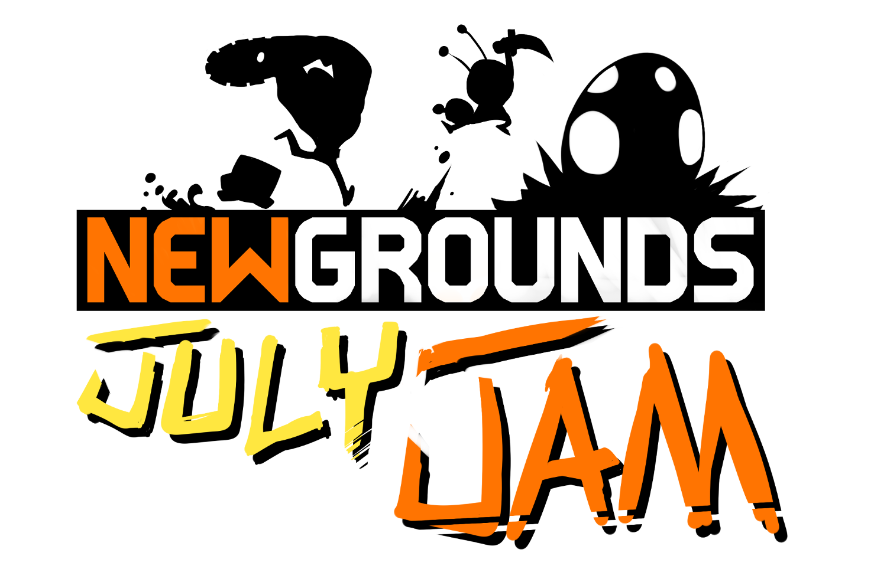
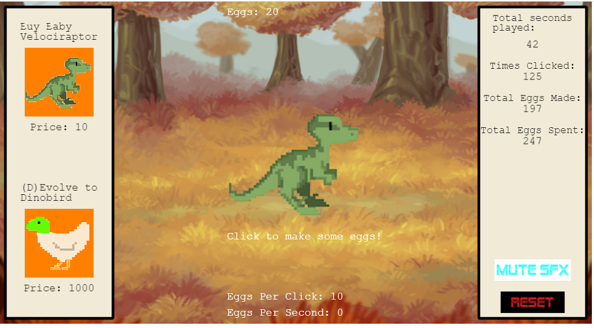

# Chicken-or-the-Egg

Which came first: the chicken or the egg? 

Answer: the egg!

# Background

A game made in one week for the July Game Jam on Newgrounds. Play it on [Newgrounds](https://www.newgrounds.com/portal/view/806922) or [GitHub](https://samjwu.github.io/Chicken-or-the-Egg/)!

The theme was very EGGxciting. Can you guess what it was?

# About

Chicken or the Egg is an idle clicker game where you try to (d)evolve as fast as possible from a dinosaur to a chicken (some scientists suggest that chickens evolved from dinosaurs!) by making eggs.

Get eggs by clicking on the mother or by making babies that will grow up to make more eggs!
